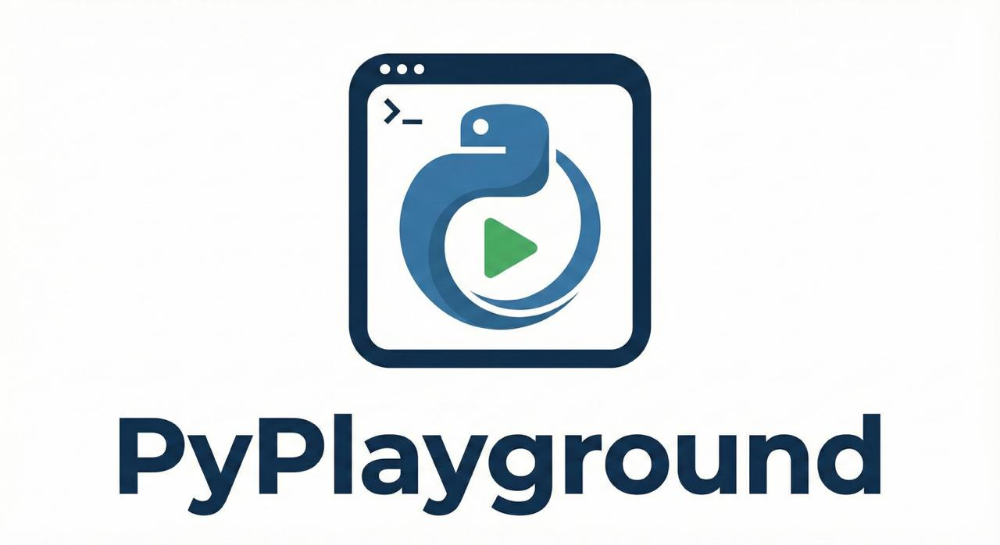
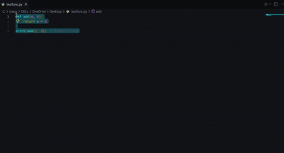
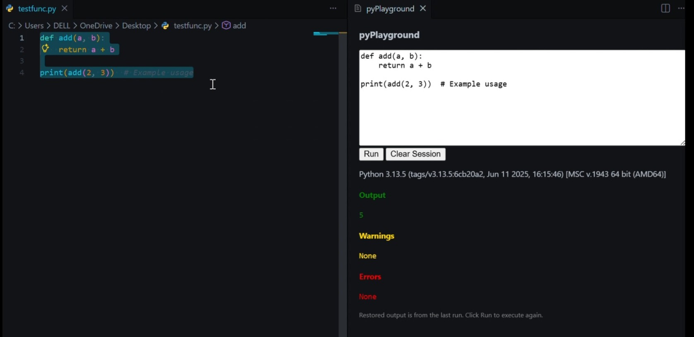
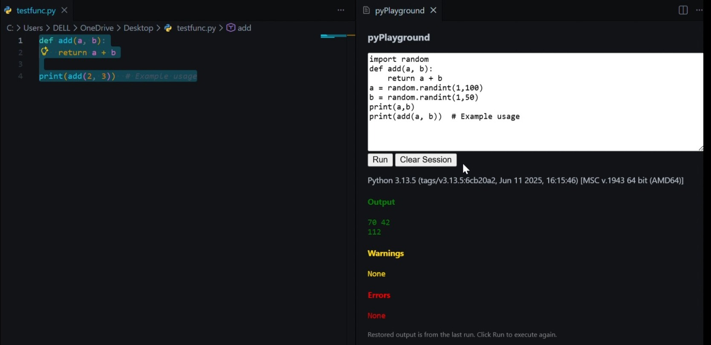

# 

[](https://marketplace.visualstudio.com/items?itemName=yourpublisher.py-playground-runner)
[](https://marketplace.visualstudio.com/items?itemName=yourpublisher.py-playground-runner)
[](LICENSE)

**Quickly run Python code snippets and functions directly inside VS Code with an interactive playground.**

pyPlayground Runner lets you test functions, expressions, and multi-line code blocks instantly, with separate output, warnings, and errors, along with Python version tracking.

---

## Demo



> Highlight Python code, right-click, and select **Run in pyPlayground**. The playground opens with your code pre-populated.

### Screenshot



---

## Features

- **Run Selected Python Code**: Highlight code → Right-click → "Run in pyPlayground"
- **Interactive Playground Panel**: Edit, modify, rerun code without switching files
- **Separate Output Display**:
  - Output → **green**
  - Warnings → **yellow**
  - Errors → **red**
- **Python Version Displayed** per run
- **Session Persistence**: Last code and outputs stored per file
- **Support for Imports**: Edit or add import lines in the playground (installed/builtin packages can be imported and used)
- **Clear Session**: Clears both outputs and code
- **Run Expressions/Functions Inline**
- **Quick Rerun**: Update code and rerun instantly
- **Right-Click Context Menu**: Seamless execution

---

## Installation

1. Install from VS Code Marketplace or build locally  
2. Open a Python file in VS Code  
3. Highlight the code you want to test  
4. Right-click → **Run in pyPlayground**  
5. Playground opens with the selected code pre-filled

---

## Usage

### Open Playground

- Command Palette → **pyPlayground: Open**
- Or run selected code via right-click context menu

### Run Selected Code

1. Highlight Python code in the editor
2. Right-click → **Run in pyPlayground**
3. Playground opens automatically
4. Click **Run** to execute
5. Outputs, Warnings, Errors, and Python Version are shown

### Clear Session

- Click **Clear Session** → clears **both outputs and code**

---

## Example

```python
def add(a, b):
    return a + b

print(add(2, 3))

```
### Example Output
```yaml
    Output:
    5
    Warnings:
    (none)
    Errors:
    (none)
    Python Version:
    3.12.0
```

## Development
```bash
    # Install dependencies
    npm install

    # Compile TypeScript
    npm run compile

    # Launch extension in VS Code
    F5 or Run & Debug
```

## TODO:

* Function picker dropdown for faster selection

* Auto-import suggestions on NameError

* Multiple Python interpreter selection

* Notebook-style cell execution

* Optional keyboard shortcut for Run in pyPlayground

## Known Issues

* Currently, multi-file sessions are stored per file only

* Auto-run on paste is not implemented

* Context menu only appears when selection exists

## LICENSE
```license
MIT License

Copyright (c) 2026 Rohan

Permission is hereby granted, free of charge, to any person obtaining a copy
of this software and associated documentation files (the "Software"), to deal
in the Software without restriction, including without limitation the rights
to use, copy, modify, merge, publish, distribute, sublicense, and/or sell
copies of the Software, and to permit persons to whom the Software is
furnished to do so, subject to the following conditions:

The above copyright notice and this permission notice shall be included in all
copies or substantial portions of the Software.

THE SOFTWARE IS PROVIDED "AS IS", WITHOUT WARRANTY OF ANY KIND, EXPRESS OR
IMPLIED, INCLUDING BUT NOT LIMITED TO THE WARRANTIES OF MERCHANTABILITY,
FITNESS FOR A PARTICULAR PURPOSE AND NONINFRINGEMENT. IN NO EVENT SHALL THE
AUTHORS OR COPYRIGHT HOLDERS BE LIABLE FOR ANY CLAIM, DAMAGES OR OTHER
LIABILITY, WHETHER IN AN ACTION OF CONTRACT, TORT OR OTHERWISE, ARISING FROM,
OUT OF OR IN CONNECTION WITH THE SOFTWARE OR THE USE OR OTHER DEALINGS IN THE
SOFTWARE.

```